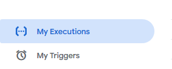
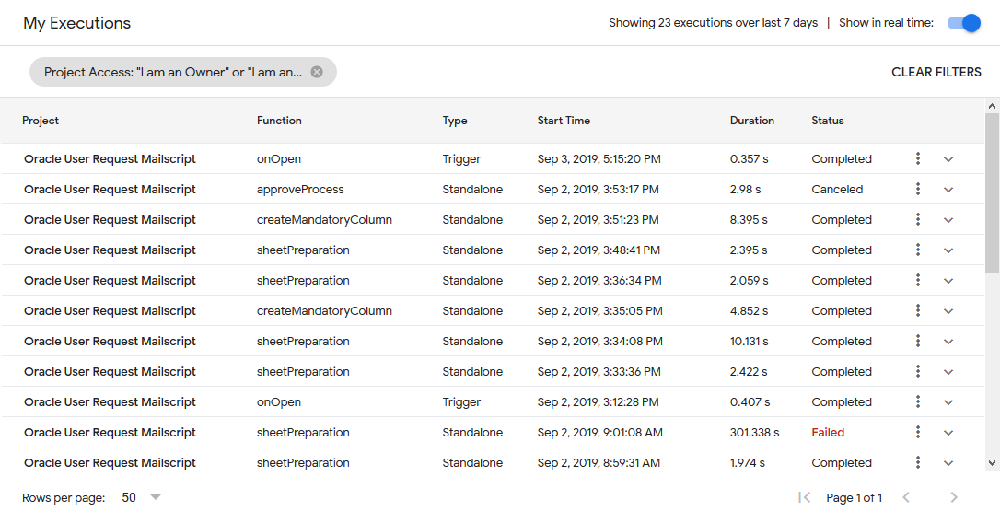
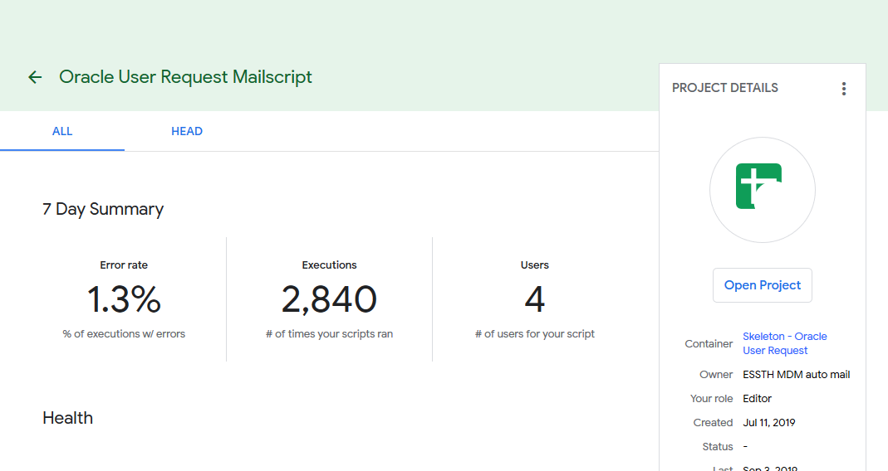

# Check execution information

If you want to check the status of each execution, you can do as following

1. Go to [https://script.google.com](https://script.google.com/)

    

2. In the sidebar menu, select 'My Executions'

    

3. There will be a list of executed functions and information about that run.
    1. Project : Google Script that runs the function
    2. Function : Function name that gets run
    3. Type : Type of execution 
    4. Start time : Time that triggers the function
    5. Duration : Duration of the execution
    6. Status : Status of that run

    

4. Done. 
But if you want to check more information about the Script, click on the project name.
The page (in Figure below) will open up.

    