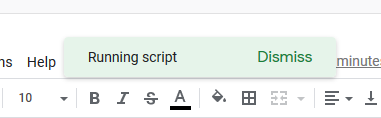
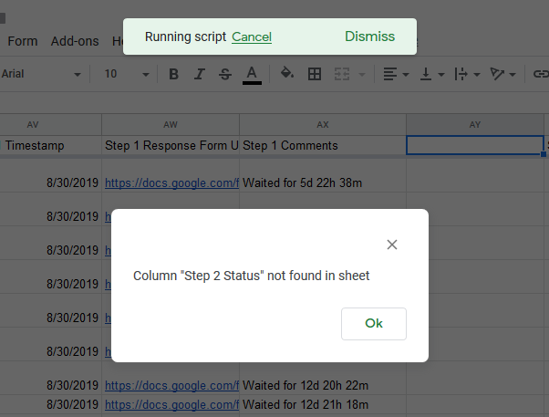

# Check whether there is a column needed

Related from: 

To start checking, you will need access to the script.

1. In 'Approval Addons' menu, select 'Sheet Preparation'.

    

2. The script will run

    

3. If there is no alert popped up, you are good to go!
But if it does, read which column went missing and fix that column. 

    

    Figure 1 : Error popup, as it cannot find 'Step 2 Status' column name