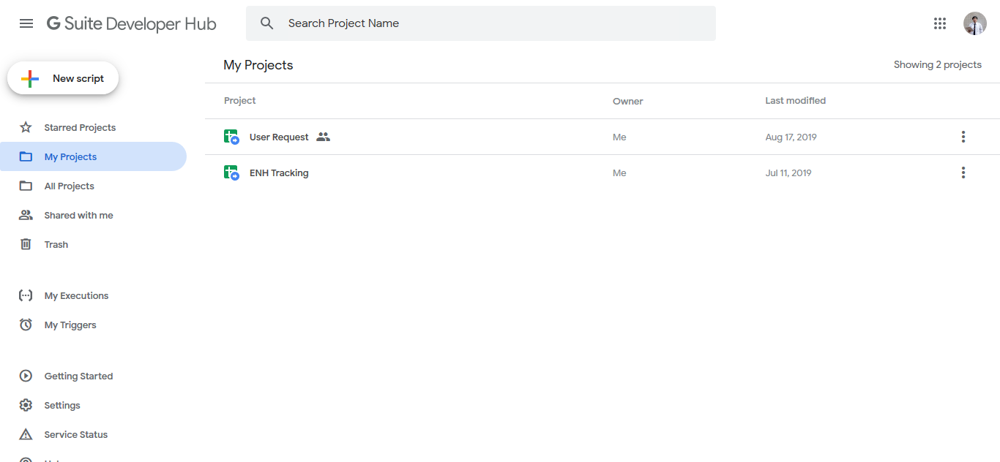
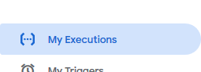
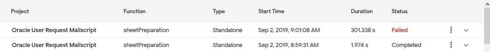
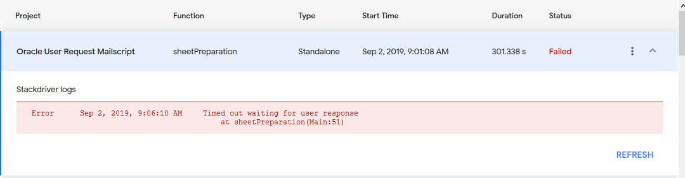

# Fixing a script error via Stack Driver log

When the script cannot read certain line or having an issue to get something, it will throws an error.
This is only sample of error. Here's how you can check the error log and trace the stack.

1. Open [https://script.google.com/](https://script.google.com/)

    

    Figure 1 : Google Script landing page

2. At the menu bar (at the left hand side), click 'My Executions'

    

    Figure 2 : 'My Executions' tab in sidebar menu

3. The page will shows the run status of each run.
Runs that marks as 'Failed' is what you are looking for an error report.

    

    Figure 3 : Status of each run

4. Click on the run to see more information

    

    Figure 4 : Stackdriver Logs list

5. You will see the logs. These log can help you to debug and fix the error.
You will have to go check the source code or/and sheet by yourself to attempt a fix.
In Fig. 4, there is an error about 'Time out waiting for user response'. and you will see which function triggers the error.

---

Reference 

[Logging | Apps Script | Google Developers](https://developers.google.com/apps-script/guides/logging#stackdriver_logging)