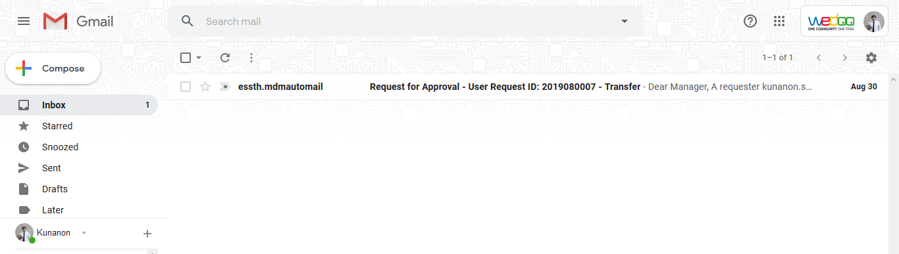
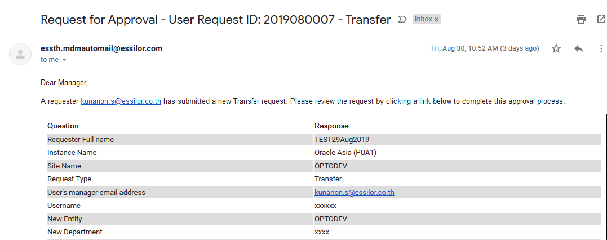
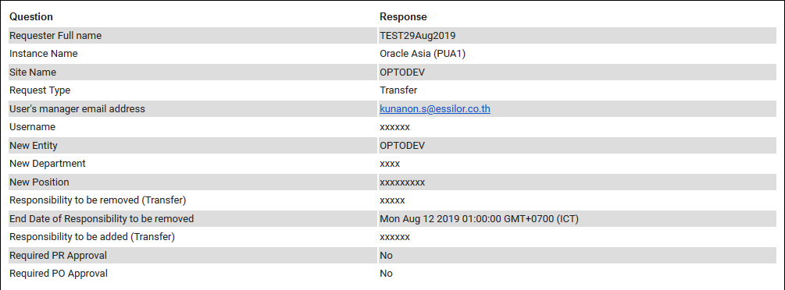
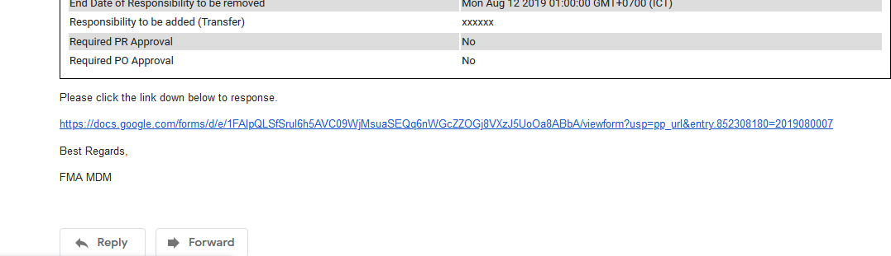
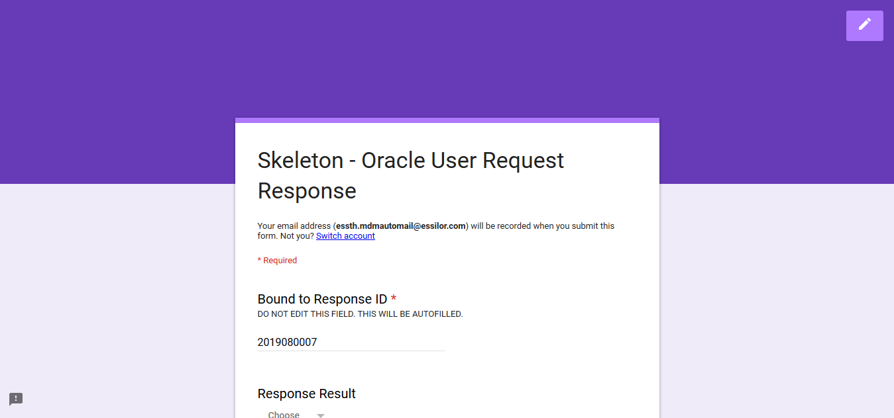
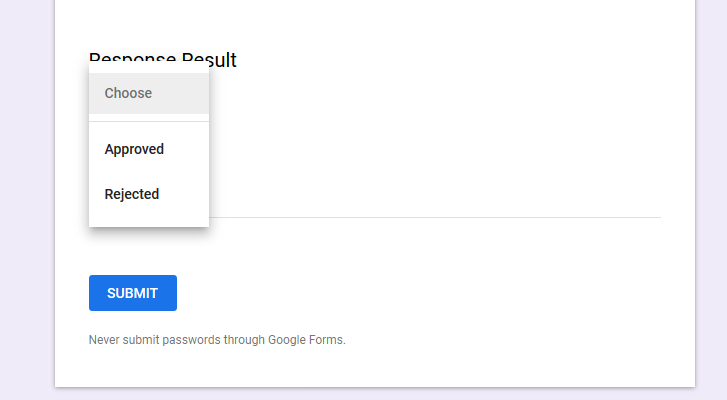

# How to approve a response

For managers and FMA, you are required to approve a request. 
This is how you can do it.

1. Go to Gmail

    

2. Click into the mail that is subject with 'Request for approval'.
This email **requires your action.**

    

3. Read the request carefully, as you are the one that approves this request.

    

4. In the bottom, you will see a Google Form link. 
Click the URL link to start the approval process.

    

5. After clicking the URL, you will be redirected to the Google Form page.

    

6. Make sure that the email address you log on is yours.

    

7. In the Google Form, in 'Response Result' question, 
choose either **'Approved'** to approve this (the email) request
or **'Rejected'** to reject this request.

    

8. Add some comments to the request (optional)

    

9. Click **'Submit'** button to submit your approval

    Make sure that the 'Bound to Response ID' is the same number as the email subject.
    It normally is the same number, but please make sure it does.

    

10. Done!
The request requester will automatically receives the notification when the approval process goes through.