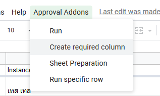

# How to automatically add system-required column 

This is only add system-required column to the header column. 
For inbound sheet, use Google Forms to automatically add any required column.

1. In the sheet that the script is contained, wait a while and see **'Approval Addons'** tab.
Click on the tab to show more options.

    

2. In the **'Approval Addons'** tab, select **'Create required column'**

    

3. Script will run and automatically add a column for you.
It also makes sure that created column will be a new ones, as they searched the name of the column and there is no result of that search query.