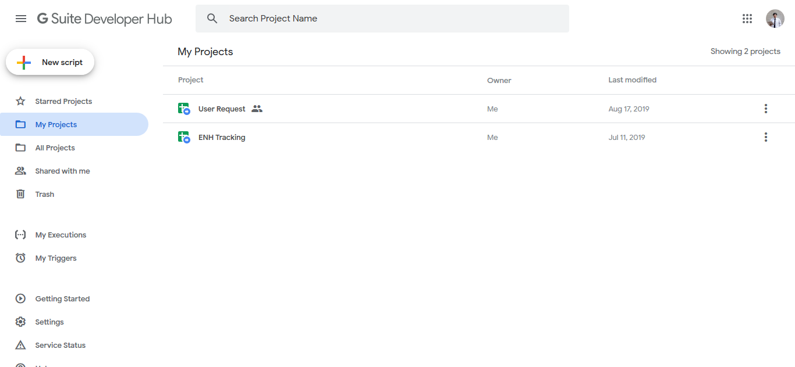
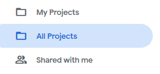
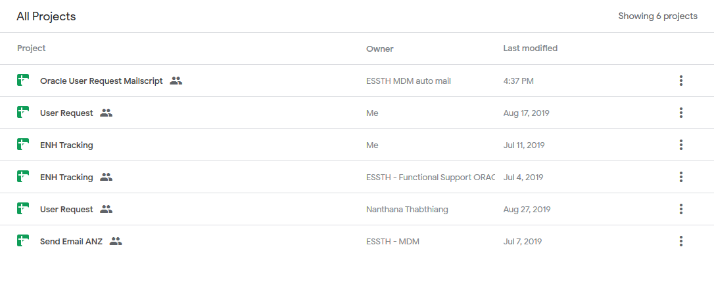
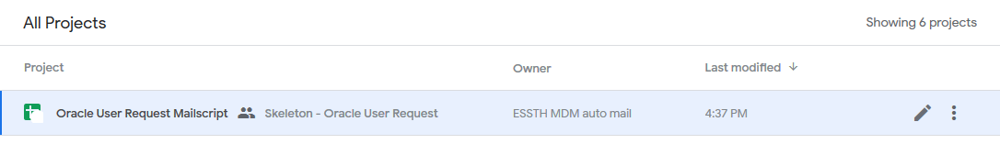
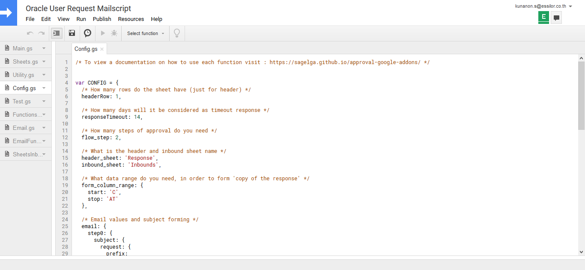
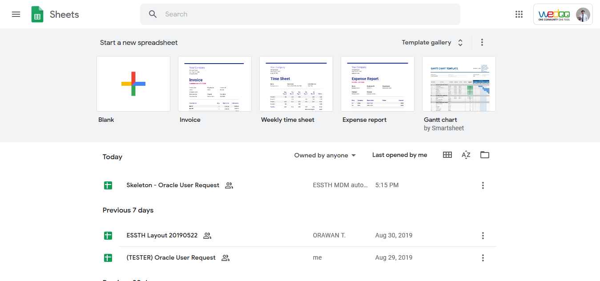
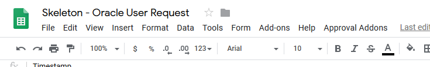

# How to edit the source code?

There is total of 2 ways to edit the source code. Here's how.

# Method One: from Google Script

1. Go to [https://script.google.com/](https://script.google.com/home)

    

2. At the sidebar menu (at the left), select 'All Projects'

    

3. In the page, there will be a list of the script that you have access to

    

4. Find the script that you want to edit the source code on.

    

5. Click 'edit' button

    

6. Google Script text editor will open up. 
You can start editing from that point on.

    

# Method Two: from Google Sheet

1. Go to [https://docs.google.com/spreadsheets](https://docs.google.com/spreadsheets),

    

2. Select the sheet that you want to edit the script with

    

3. Check the menu.
In the menu, find 'Tools'

    

    

4. In 'Tools', select 'Script editor'.

    

    

5. You will be redirected to Google Script.

    