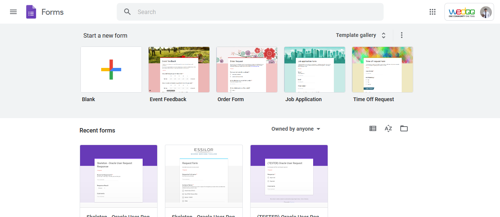
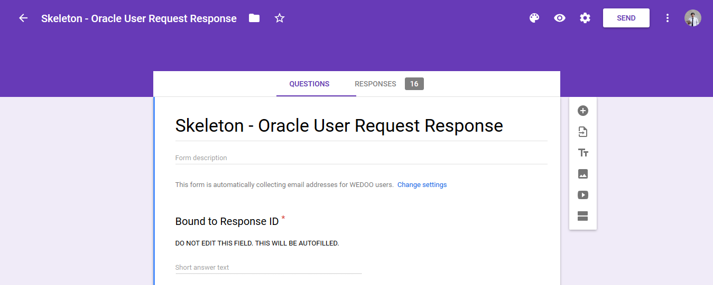
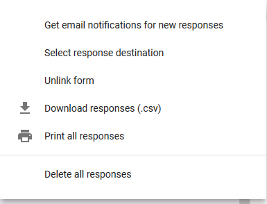
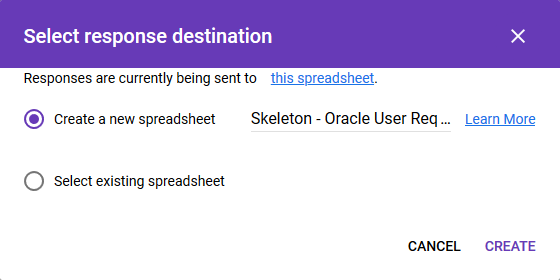
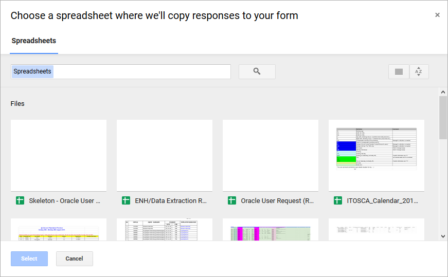

# How to link a form to spreadsheet

Here's how you can link it to the spreadsheet. 

1. Go to the form page by visiting [https://docs.google.com/forms](https://docs.google.com/forms)
Then open the form that you want to do action to. 

    

    

2. In the form page, click `Responses`

    

3. Click the 3 button (as seen in Exhibit B)

    

    Exhibit B : Edit

4. The menu pops up (as Exhibit C). 
Click the `Select response destination`

    

    Exhibit C : Response Options Menu

5.  The 'Select response destination' menu pops up. (as Exhibit D)
Click `Select existing spreadsheet`

    

    Exhibit D : Select response destination menu

6. Choose a destination sheet.

    

7. Done.