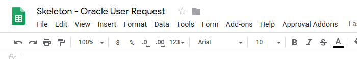
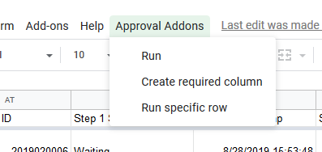
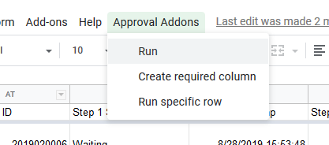

# How to manually starts the flow

Normally, the flow starts automatically. But when you like to starts the flow now, you can use the UI.

1. Open the sheet
2. In the tool bar, select `Approval Addons`

    

    

3. Click `Run`

    