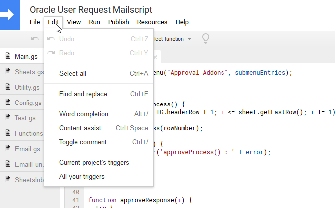
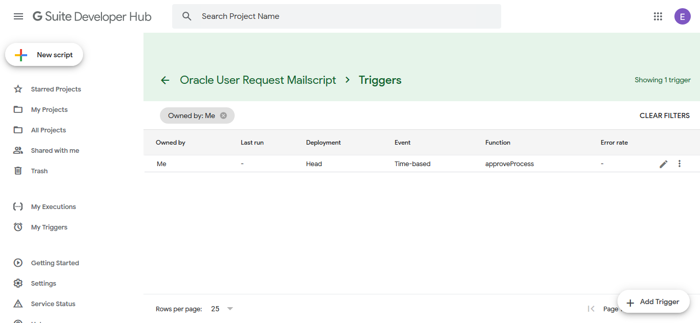

# How to setup script triggers

LAST UPDATE: 29 August 2019
This page may change due to Google.
To fully understand how the script trigger works, please read the Google Developer website for more information. 

Make sure that you are following the Google procedure and use the configurations that is in this help page.

This is how you can setup the script triggers.

1. Go to the Script editing page
2. Click `Edit`.

    

3. Click `Current project's triggers`.

    

4. Click `Add Trigger`.
5. Edit the parameters.
    1. Choose `approveProcess` as the trigger function

---

If you liked to change your trigger behavior later on, you can read how to on at the link below.