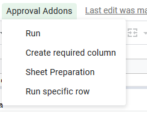
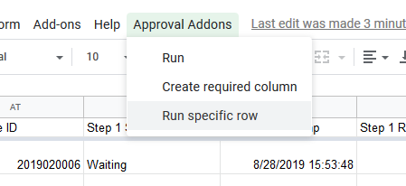
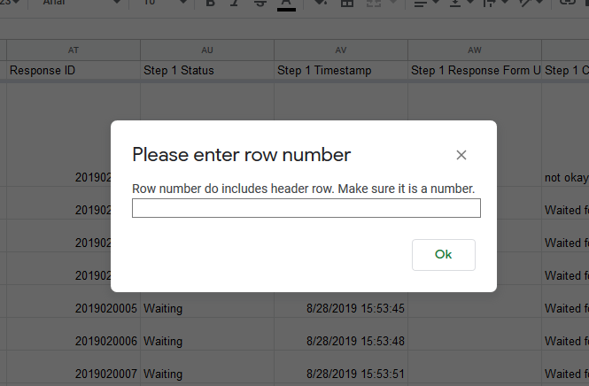

# How to update only one row

Usually, you don't have to check for everything when there is another row coming in, or you have override something that the system should be notified about. This is how you can run only 1 row (instead of all rows)

1. Open the sheet
2. In the tool bar, select `Approval Addons`

    

    

3. Click `Run specific row`

    

4. There will be a prompt for row number.
Type in the row number that you like to compute

    

5. System will compute that specific row. Do mind that they will run only that row.