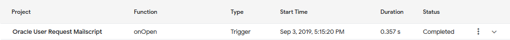

# Types of function trigger

Reference

[Simple Triggers | Apps Script | Google Developers](https://developers.google.com/apps-script/guides/triggers/)

To check what status of the current run, open 'My Executions' → go to the first run

Most frequent function trigger includes:

- Trigger → When the Google Sheet has been open, triggers the specified function that is the same cause as the function name that gets triggered (onOpen function got activated = Google Sheet has been opened)
- Time Driven → For every xxx time, triggers the specified function. Can be set to any time range.
- Standalone → When script is triggered by UI or the text editor (manually triggers)