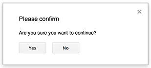
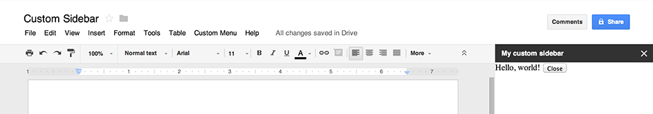

# UI Dialogs and Sidebars

[https://developers.google.com/apps-script/guides/dialogs](https://developers.google.com/apps-script/guides/dialogs)

Scripts that are [bound](https://developers.google.com/apps-script/scripts_containers) to Google Docs, Sheets, or Forms can display several types of user-interface elements — pre-built alerts and prompts, plus dialogs and sidebars that contain custom [HTML service](https://developers.google.com/apps-script/guides/html) pages. Typically, these elements are opened from [menu items](https://developers.google.com/apps-script/guides/menus). (Note that in Google Forms, user-interface elements are visible only to an editor who opens the form to modify it, not to a user who opens the form to respond.)

## Alert dialogs

An alert is a pre-built dialog box that opens inside a Google Docs, Sheets, Slides, or Forms editor. It displays a message and an "OK" button; a title and alternative buttons are optional. It is similar to calling `[window.alert()](https://developer.mozilla.org/en-US/docs/Web/API/window.alert)` in client-side JavaScript within a web browser.

Alerts suspend the server-side script while the dialog is open. The script resumes after the user closes the dialog, but [JDBC](https://developers.google.com/apps-script/guides/jdbc) connections do not persist across the suspension.

As shown in the example below, Google Docs, Forms, Slides, and Sheets all use the method `[Ui.alert()](https://developers.google.com/apps-script/reference/base/ui#alert(String))`, which is available in three variants. To override the default "OK" button, pass a value from the `[Ui.ButtonSet](https://developers.google.com/apps-script/reference/base/button-set)` enum as the `buttons` argument. To evaluate which button the user clicked, compare the return value for `alert()` to the `[Ui.Button](https://developers.google.com/apps-script/reference/base/button)` enum.

    function onOpen() {  SpreadsheetApp.getUi() // Or DocumentApp or SlidesApp or FormApp.      .createMenu('Custom Menu')      .addItem('Show alert', 'showAlert')      .addToUi();}function showAlert() {  var ui = SpreadsheetApp.getUi(); // Same variations.  var result = ui.alert(     'Please confirm',     'Are you sure you want to continue?',      ui.ButtonSet.YES_NO);  // Process the user's response.  if (result == ui.Button.YES) {    // User clicked "Yes".    ui.alert('Confirmation received.');  } else {    // User clicked "No" or X in the title bar.    ui.alert('Permission denied.');  }}

## Prompt dialogs

A prompt is a pre-built dialog box that opens inside a Google Docs, Sheets, Slides, or Forms editor. It displays a message, a text-input field, and an "OK" button; a title and alternative buttons are optional. It is similar to calling `[window.prompt()](https://developer.mozilla.org/en-US/docs/Web/API/window.prompt)` in client-side JavaScript within a web browser.

Prompts suspend the server-side script while the dialog is open. The script resumes after the user closes the dialog, but [JDBC](https://developers.google.com/apps-script/guides/jdbc) connections do not persist across the suspension.

As shown in the example below, Google Docs¸ Forms, Slides, and Sheets all use the method `[Ui.prompt()](https://developers.google.com/apps-script/reference/base/ui#prompt(String))`, which is available in three variants. To override the default "OK" button, pass a value from the `[Ui.ButtonSet](https://developers.google.com/apps-script/reference/base/button-set)` enum as the `buttons` argument. To evaluate the user's response, capture the return value for `prompt()`, then call `[PromptResponse.getResponseText()](https://developers.google.com/apps-script/reference/base/prompt-response#getResponseText())` to retrieve the user's input, and compare the return value for `[PromptResponse.getSelectedButton()](https://developers.google.com/apps-script/reference/base/prompt-response#getSelectedButton())` to the `[Ui.Button](https://developers.google.com/apps-script/reference/base/button)` enum.

    function onOpen() {  SpreadsheetApp.getUi() // Or DocumentApp or SlidesApp or FormApp.      .createMenu('Custom Menu')      .addItem('Show prompt', 'showPrompt')      .addToUi();}function showPrompt() {  var ui = SpreadsheetApp.getUi(); // Same variations.  var result = ui.prompt(      'Let\'s get to know each other!',      'Please enter your name:',      ui.ButtonSet.OK_CANCEL);  // Process the user's response.  var button = result.getSelectedButton();  var text = result.getResponseText();  if (button == ui.Button.OK) {    // User clicked "OK".    ui.alert('Your name is ' + text + '.');  } else if (button == ui.Button.CANCEL) {    // User clicked "Cancel".    ui.alert('I didn\'t get your name.');  } else if (button == ui.Button.CLOSE) {    // User clicked X in the title bar.    ui.alert('You closed the dialog.');  }}

## Custom dialogs

A custom dialog can display an [HTML service](https://developers.google.com/apps-script/guides/html/) user interface inside a Google Docs, Sheets, Slides, or Forms editor.

Custom dialogs do *not* suspend the server-side script while the dialog is open. The client-side component can make asynchronous calls to the server-side script using either the `[google.script](https://developers.google.com/apps-script/guides/html/communication)` API for HTML-service interfaces or [server handlers](https://developers.google.com/apps-script/guides/ui-service#ServerHandlers) for UI-service interfaces.

The dialog can close itself by calling `[google.script.host.close()](https://developers.google.com/apps-script/guides/html/communication#closing_dialogs_and_sidebars_in_google_apps)` in the client side of an HTML-service interface. The dialog cannot be closed by other interfaces, only by the user or itself.

As shown in the example below, Google Docs, Forms, Slides, and Sheets all use the method `[Ui.showModalDialog()](https://developers.google.com/apps-script/reference/base/ui#showModalDialog(Object,String))` to open the dialog.

    function onOpen() {  SpreadsheetApp.getUi() // Or DocumentApp or SlidesApp or FormApp.      .createMenu('Custom Menu')      .addItem('Show dialog', 'showDialog')      .addToUi();}function showDialog() {  var html = HtmlService.createHtmlOutputFromFile('Page')      .setWidth(400)      .setHeight(300);  SpreadsheetApp.getUi() // Or DocumentApp or SlidesApp or FormApp.      .showModalDialog(html, 'My custom dialog');}

## Custom sidebars

A sidebar can display an [HTML service](https://developers.google.com/apps-script/guides/html/) user interface inside a Google Docs, Forms, Slides, or Sheets editor.

Sidebars do *not* suspend the server-side script while the dialog is open. The client-side component can make asynchronous calls to the server-side script using either the `[google.script](https://developers.google.com/apps-script/guides/html/communication)` API for HTML-service interfaces or [server handlers](https://developers.google.com/apps-script/guides/ui-service#ServerHandlers) for UI-service interfaces.

The sidebar can close itself by calling `[google.script.host.close()](https://developers.google.com/apps-script/guides/html/communication#closing_dialogs_and_sidebars_in_google_apps)` in the client side of an HTML-service interface. The sidebar cannot be closed by other interfaces, only by the user or itself.

As shown in the example below, Google Docs, Forms, Slides, and Sheets all use the method `[Ui.showSidebar()](https://developers.google.com/apps-script/reference/base/ui#showSidebar(Object))` to open the sidebar.

    function onOpen() {  SpreadsheetApp.getUi() // Or DocumentApp or SlidesApp or FormApp.      .createMenu('Custom Menu')      .addItem('Show sidebar', 'showSidebar')      .addToUi();}function showSidebar() {  var html = HtmlService.createHtmlOutputFromFile('Page')      .setTitle('My custom sidebar')      .setWidth(300);  SpreadsheetApp.getUi() // Or DocumentApp or SlidesApp or FormApp.      .showSidebar(html);}

## File-open dialogs

[Google Picker](https://developers.google.com/picker/) is a "file-open" dialog for information stored in Google servers, including Google Drive, Google Image Search, Google Video Search, and more.

As shown in the example below, Picker's client-side JavaScript API can be used in [HTML service](https://developers.google.com/apps-script/guides/html) to create a custom dialog that lets users select existing files or upload new ones, then pass that selection back to your script for further use.

**Note:** In order to use Google Picker, your script project must be using a [standard Cloud Platform (GCP) project](https://developers.google.com/apps-script/guides/cloud-platform-projects#standard_cloud_platform_projects).

To enable Picker and obtain an API key, follow these instructions:

1. Verify that your script project is using a [standard GCP project](https://developers.google.com/apps-script/guides/cloud-platform-projects#standard_cloud_platform_projects).
2. While your GCP project is still open, select **APIs & Services**, then click **Credentials**.
3. Select the **Credentials** tab.
4. Click **Create credentials > API key**. This creates the key, but you should restrict it. Click **Restrict Key**.
5. In the new tab, select the **HTTP referrers (web sites)** radio button.
6. In the referer section that appears, add these URLs as referers, then click **Save**: 

        *.google.com*.googleusercontent.com

7. In the **Credentials** tab, copy the API key you created for use below, then return to the script editor and click **Close** to close the dialog.

The following example calls `[ScriptApp.getOAuthToken()](https://developers.google.com/apps-script/reference/script/script-app#getOAuthToken())` so that it can pass the user's OAuth 2.0 access token to Picker. This technique keeps Picker from needing to show its own authorization dialog, but is only possible if the [OAuth scope that Picker needs](https://developers.google.com/picker/docs/#otherviews) is available in Apps Script. Otherwise, your Picker code will need to declare its own OAuth scopes, as shown [this "hello world" example](https://developers.google.com/picker/docs/#hiworld). You must call `setOrigin(google.script.host.origin)` when constructing the `PickerBuilder`.

    /** * Creates a custom menu in Google Sheets when the spreadsheet opens. */function onOpen() {  SpreadsheetApp.getUi().createMenu('Picker')      .addItem('Start', 'showPicker')      .addToUi();}/** * Displays an HTML-service dialog in Google Sheets that contains client-side * JavaScript code for the Google Picker API. */function showPicker() {  var html = HtmlService.createHtmlOutputFromFile('dialog.html')      .setWidth(600)      .setHeight(425)      .setSandboxMode(HtmlService.SandboxMode.IFRAME);  SpreadsheetApp.getUi().showModalDialog(html, 'Select a file');}/** * Gets the user's OAuth 2.0 access token so that it can be passed to Picker. * This technique keeps Picker from needing to show its own authorization * dialog, but is only possible if the OAuth scope that Picker needs is * available in Apps Script. In this case, the function includes an unused call * to a DriveApp method to ensure that Apps Script requests access to all files * in the user's Drive. * * @return {string} The user's OAuth 2.0 access token. */function getOAuthToken() {  DriveApp.getRootFolder();  return ScriptApp.getOAuthToken();}